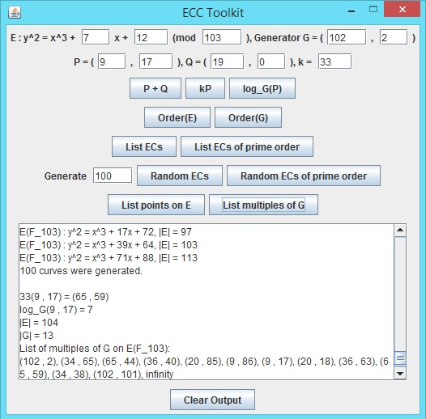

# Elliptic Curve Cryptography (ECC) Toolkit

Elliptic Curve Cryptography (ECC) Toolkit
Last Updated: January 28, 2016
Author: Aaron Blumenfeld

## ABOUT:

This is a basic Java Swing application to implement the most commonly used computations
in elliptic curve cryptography. It is intended to be used for instructive purposes by
both students and educators studying cryptography. Only primes less than 10,000 are
supported, and only primes p under 300 are supported for generating lists of all curves
(or all curves with prime order) mod p. This is because the number of curves mod p grows
too fast as p grows. For larger primes, you can generate a fixed number of randomly
chosen curves (general curves, or curves with prime order).

A discrete logarithm of -1 indicates an error. This means that there is no solution. For
example, if you choose a non-cyclic elliptic curve group and want to solve kG = P, where
G generates a proper subgroup of E and P lies in a different coset, there will be no solution.

I did not implement error detection for trying to do point arithmetic when the point is not
on the curve. Perhaps it can be instructive to see what happens with the calculations in this
situation. But there is a function for listing all points on the curve. Instead of the obvious
method using two nested loops, this uses one loop by computing x^3 + ax + b for each x in F_p,
checking if this value is a quadratic residue or not, and if so, finding both square roots
using the Tonelli-Shanks algorithm.

The logarithm calculator just uses brute force. I considered using something like Pollard's
Rho algorithm, but that would require  inverting numbers modulo n (or possibly modulo n/k
for some k > 1 and checking the k possibilities modulo n). This could be done, but it's
overkill for dealing with relatively small groups.

The factoring method just uses brute force. I considered using something like Pollard's Rho
algorithm for finding prime factors, but that would require creating a list of all factors
from a list of prime factors. This could be done, but it's overkill for dealing with
relatively small groups. (It's also possible to get stuck in a cycle that doesn't lead to a
nontrivial factor when using Pollard's Rho algorithm.)

## FILES:

- ECC.java: The driver for the GUI application.
- ECMath.java: Various static method with implementations of mathematical functions (modular exponentiation, inverses, square roots, primality testing, etc.)
- EllipticCurve.java: A class that implements elliptic curves, including logarithms, orders, as well as lists of points. Also a few static methods for listing elliptic curves.
- Point.java: A class that implements points. 3D points are used for projective coordinates, but they're only printed as 2D points. Point addition and multiplication are implemented here.

## TO RUN:

Please run by placing all the files in the same directory, opening a command prompt, and typing in "javac ECC.java" and "java ECC".

## TO DO:

Possibly write an extension of this to support ECC over binary fields GF(2^k).