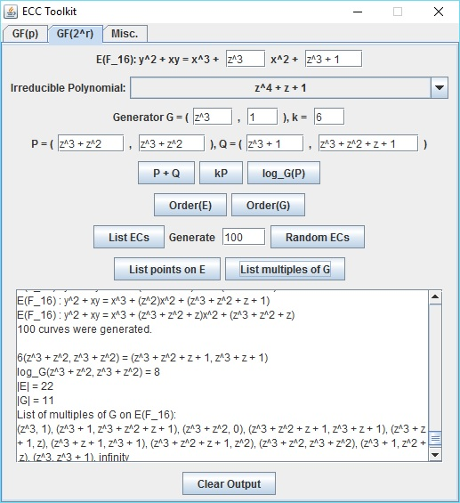
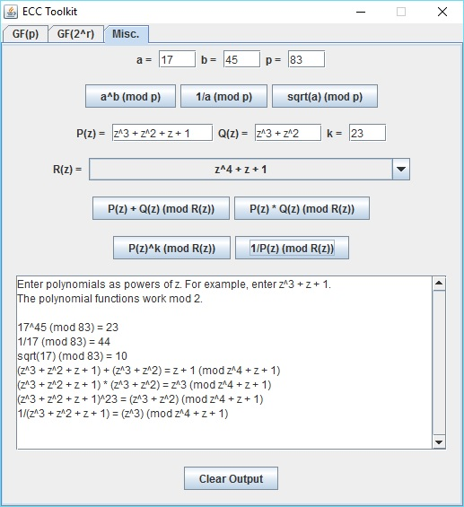

# Elliptic Curve Cryptography (ECC) Toolkit

Elliptic Curve Cryptography (ECC) Toolkit  
Last Updated: June 15, 2016  
Author: Aaron Blumenfeld

## ABOUT:

This is a basic Java Swing application to implement the most commonly
used computations in elliptic curve cryptography. It is intended to be
used for instructive purposes (by students or educators) studying
cryptography. Only primes p < 10,000 are supported, and only primes 
p < 300 are supported for generating lists of all curves (or all curves
with prime order) mod p. This is because the number of curves mod p
grows too quickly as p grows. For larger primes, you can generate a
fixed number of randomly chosen curves (general curves, or curves with
prime order).

For binary elliptic curves, only fields F_m for m = 2, 4, 8, ..., 1024 
are supported. Again, this program is only designed for instructive
purposes. Only binary fields with up to 1024 elements are supported.
You can choose a field by selecting an irreducible polynomial from the
drop-down menu. Only binary fields with up to 64 elements are supported
for generating lists of all curves. This is because the number of curves
over these fields grows too quickly as the size of the field grows. For
larger fields, you can generate a fixed number of randomly chosen curves.

A discrete logarithm of -1 indicates an error. This means that there is
no solution. For example, if you choose a non-cyclic elliptic curve group
and want to solve kG = P, where G generates a proper subgroup of E and P
lies in a different coset, there will be no solution.

I did not implement error detection for trying to do point arithmetic when
the point is not on the curve. Perhaps it can be instructive to see what
happens with the calculations in this situation.

There is also a Misc. tab, which includes support for exponentiation, inverses,
and square roots (mod p), as well as addition, multiplication, inverses, 
exponentiation, and square roots of polynomials in finite fields.

When you enter a value in the GF(p) tab (other than the modulus, k, and n), it
automatically gets reduced mod p. Similarly, when you enter a polynomial in
the GF(2^r) and Misc. tabs, it automatically gets reduced mod the irreducible
polynomial and R(z), respectively.

## SOURCE FILES:

- BinaryEllipticCurve.java: A class that implements elliptic curves over binary fields, including logarithms, orders, as well as lists of points. Also a few static methods for listing elliptic curves.
- BinaryPanel.java: An extension of JPanel for exploring elliptic curves over binary fields.
- ECC.java: The driver for the GUI application.
- ECMath.java: Various static method with implementations of mathematical functions (modular exponentiation, inverses, square roots, primality testing, etc.)
- EllipticCurve.java: A class that implements elliptic curves, including logarithms, orders, as well as lists of points. Also a few static methods for listing elliptic curves.
- MiscPanel.java: An extension of JPanel for exploring various computations useful for elliptic curve cryptography (modular exponentiation, polynomial inverses, etc.).
- Point.java: A class that implements points. 3D points are used for projective coordinates, but they're only printed as 2D points. Point addition and multiplication are implemented here.
- Polynomial.java: A class that implements (sparse) Polynomials mod 2 using HashSets.
- PolynomialPoint.java: A class that implements polynomial points. 3D points are used for LD projective coordinates, but they're only printed as 2D points. Point addition and multiplication are implemented here.
- PrimePanel.java: An extension of JPanel for exploring elliptic curves over prime fields.